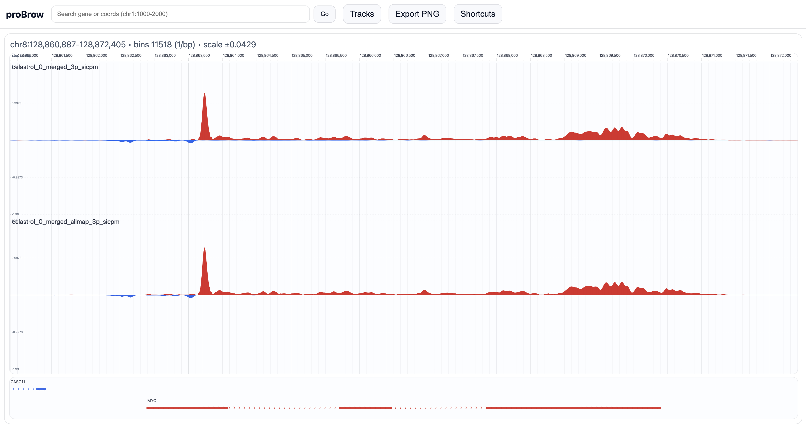

# proBrow

proBrow is a small, local genome browser built for looking at strand-specific PRO-seq data. It runs entirely on your own machine — no server setup, no cloud, nothing leaves your computer. Point it at a folder of bigWig files and a gene annotation, and it opens in your browser.



---

## Why

Most genome browsers are either too heavy to run locally or not great at showing plus/minus strand PRO-seq signal side by side. proBrow does one thing well: strand-aware signal from bigWigs, stacked per sample, with fast keyboard-driven navigation.

---

## Requirements

Python 3.10 or newer. That's it — the launch script handles the virtual environment automatically.

---

## Quick start

```bash
git clone https://github.com/SerhatAktay/proBrow.git
cd proBrow

# Use a built-in genome annotation (downloads once, cached for future runs):
./probrow.sh --genome hg38 --bigwig-folder /path/to/bigwigs/

# Or bring your own GTF:
./probrow.sh --genes /path/to/genes.gtf --bigwig-folder /path/to/bigwigs/
```

On first run it creates a virtualenv, installs dependencies, starts the server, and opens your browser. Stop with `Ctrl+C`.

---

## Loading data

### bigWig files (`--bigwig-folder`)

Give it a folder and proBrow will scan recursively for `.bw` / `.bigWig` files. It guesses strand from filename tokens (`plus`, `pos`, `fwd`, `forward`, `minus`, `neg`, `rev`, `reverse`) and groups files into samples by removing those tokens from the name. Files with no recognisable strand token are skipped.

If auto-detection doesn't work for your naming scheme, use explicit `--track` flags instead:

```bash
./probrow.sh \
  --track "WT,/path/WT_plus.bw,+" \
  --track "WT,/path/WT_minus.bw,-" \
  --genome hg38
```

### Gene annotations (`--genome` or `--genes`)

The easiest option is `--genome`, which downloads and caches a GTF for common assemblies:

| Name | Assembly | Source |
|---|---|---|
| `hg38` | Human GRCh38 | Ensembl 113 |
| `hg19` | Human GRCh37 | Ensembl 87 |
| `hs1` | Human T2T CHM13v2 | UCSC ncbiRefSeq |
| `mm39` | Mouse GRCm39 | Ensembl 113 |
| `mm10` | Mouse GRCm38 | Ensembl 102 |
| `dm6` | Drosophila BDGP6 | Ensembl 113 |
| `ce11` | C. elegans WBcel235 | Ensembl 113 |
| `danRer11` | Zebrafish GRCz11 | Ensembl 113 |
| `sacCer3` | S. cerevisiae R64-1-1 | Ensembl 113 |

GTFs are stored in `~/.cache/probrow/genomes/` and reused on subsequent runs.

For a custom annotation use `--genes` with a GTF/GFF3 file (plain or `.gz`), or a simple TSV with columns `chr`, `start`, `end`, `name`, `strand`.

### Config file (`--config`)

If you're always loading the same dataset, put your options in a TOML file:

```toml
# probrow.toml
genome        = "hg38"
bigwig_folder = "/data/my_project/bigwigs"
```

Then just run `./probrow.sh --config probrow.toml`. CLI flags take priority over anything in the config file. Requires Python ≥ 3.11, or on Python 3.10: `pip install -e "backend/.[config]"`.

---

## Navigation

The URL updates as you move around, so you can copy it and share a locus with a colleague. The full shortcut list is in the **Shortcuts** panel (`?`), but the ones used most:

| Key | What it does |
|---|---|
| Click + drag | Pan |
| Scroll / `+` / `-` | Zoom |
| Shift + drag | Zoom to selection |
| `[` / `]` | Y scale down/up |
| `a` | Autoscale to current view |
| `s` / `S` | Smooth signal less/more (bp-aware, up to 20 kb) |
| `k` / `K` | Sharpen signal less/more |
| `p` | Toggle per-sample vs. shared Y scale |
| `b` / `B` | Fewer/more bins |
| `e` | Export view as PNG |

The **Tracks** button lets you reorder lanes and overlay multiple samples. **Export PNG** saves both the signal and gene tracks as a single image.

---

## CLI reference

```
./probrow.sh --help
```

| Flag | Description |
|---|---|
| `--bigwig-folder PATH` | Folder to scan for bigWig files |
| `--track NAME,PATH,STRAND` | Explicit track (repeatable) |
| `--genes PATH` | GTF/GFF3 or TSV annotation |
| `--genome NAME` | Built-in annotation (downloads on first use) |
| `--config PATH` | TOML config file |
| `--host HOST` | Bind host (default: `127.0.0.1`) |
| `--port PORT` | Port (default: random free port) |
| `--no-open` | Don't open a browser tab |
| `--verbose` | Log server requests |
| `--version` | Print version and exit |

---

## Shell autocomplete (optional)

```bash
cd backend
source .venv/bin/activate
pip install -e ".[autocomplete]"

# zsh
autoload -U bashcompinit && bashcompinit
eval "$(register-python-argcomplete probrow)"

# bash
eval "$(register-python-argcomplete probrow)"
```

---

## License

[MIT](LICENSE)
